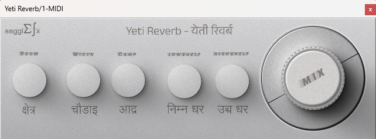

# YetiReverb

## Overview
YetiReverb is a reverb plugin built using JUCE reverb modules and additional filters. It is being developed as a community plugin aimed at new Nepali producers, featuring a user friendly interface adorned with Nepali fonts and unique parameter names.

## Features
- Based on FDN (Feedback Delay Network) reverb architecture.
- Includes additional lowshelf and highshelf filters to enhance the sound effect.

## User Interface

## Heads-up
This project is currently in development. The UI, especially the knobs, will be updated to have a much better aesthetic when time permits.
